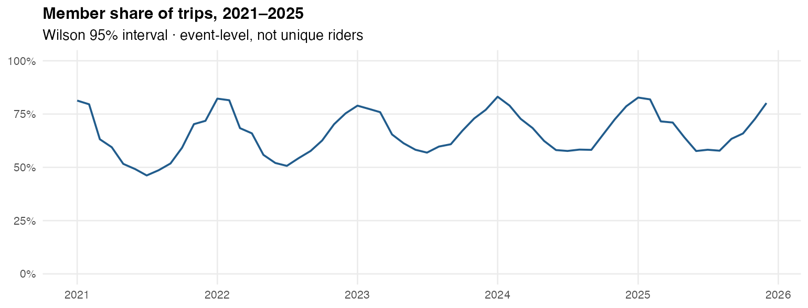
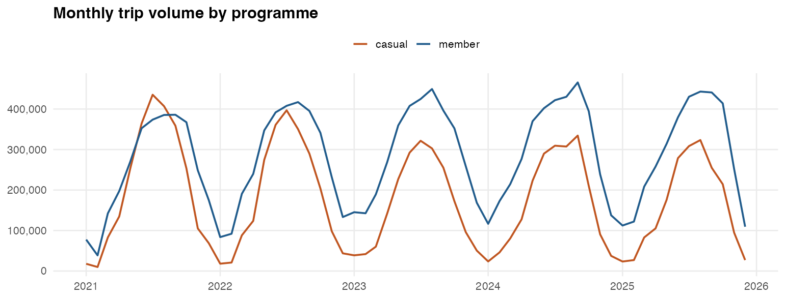

# Cyclistic Programme Monitor

**[Open the dashboard](https://thacienneuwimanayantumye.github.io/Cyclistic-Bike-Share-Analysis/)** — 27.7 million Chicago Divvy trips, 2021–2025.

[](https://thacienneuwimanayantumye.github.io/Cyclistic-Bike-Share-Analysis/)

How **annual members** and **casual riders** use the system. Indicators are **trip-level** (there is no rider id, so this is not unique-person coverage).

| | |
|---|---|
| **Dashboard** | [GitHub Pages](https://thacienneuwimanayantumye.github.io/Cyclistic-Bike-Share-Analysis/) (static) · Shiny app in `dashboard/` |
| **Methods** | [`docs/METHODS.md`](docs/METHODS.md) |
| **Data product** | `data/derived/` (aggregates only; raw zips are not in git) |

[](https://thacienneuwimanayantumye.github.io/Cyclistic-Bike-Share-Analysis/)

## What this demonstrates

An R **pipeline → quality rules → indicator tables → dashboard** workflow, the same shape as programme-monitoring data products (not a cancer-screening analysis).

- `{targets}` processes each month independently; only summaries are published  
- Wilson intervals, median duration, weekday×hour timing, STL trend, data-quality drop rates  
- DuckDB SQL in `inst/sql/` · tests in `tests/` · Docker for the Shiny app  

<details>
<summary>Reproduce locally</summary>

1. Put `YYYYMM-divvy-tripdata.zip` files (2021–2025) in `data/raw/` from the [Divvy index](https://divvy-tripdata.s3.amazonaws.com/index.html).

2. Pipeline, tests, Shiny, static dashboard:

```r
install.packages(c("targets", "tarchetypes", "tidyverse", "duckdb", "DBI",
                   "shiny", "bslib", "bsicons", "here", "testthat", "markdown"))
targets::tar_make()
testthat::test_dir("tests/testthat")
shiny::runApp("dashboard")
```

```bash
quarto render docs/index.qmd
quarto render analysis/report.qmd
docker build -t cyclistic-monitor . && docker run --rm -p 3838:3838 cyclistic-monitor
```

</details>

<details>
<summary>Repository map</summary>

| Path | Role |
|---|---|
| `docs/index.html` | Public dashboard (GitHub Pages) |
| `dashboard/` | Interactive Shiny app (filters, quality tables) |
| `R/` + `_targets.R` | Ingest → validate → clean → indicators |
| `data/derived/` | Published CSV tables for the apps |
| `inst/sql/` | DuckDB queries |
| `docs/METHODS.md` | Indicator dictionary |
| `tests/` | Cleaning and interval tests |
| `AI.md` | How agentic AI was used |

</details>

## License

Code: MIT. Trip files remain under Motivate’s [data license](https://divvybikes.com/data-license-agreement) and are not stored in this repository.
