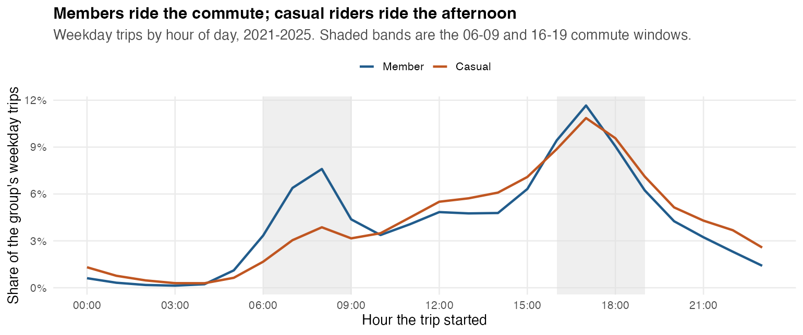
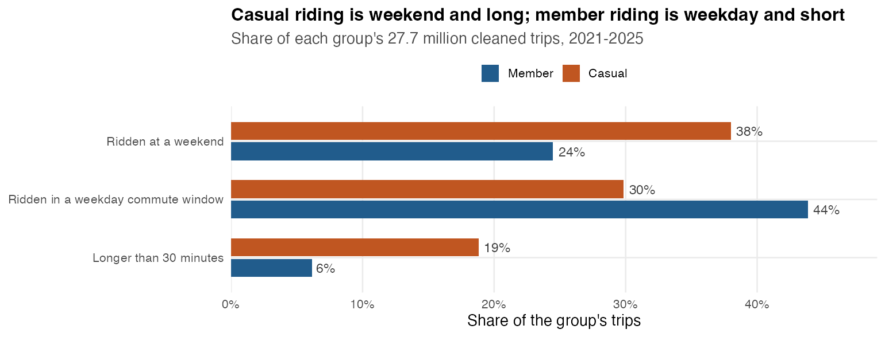

# Cyclistic Programme Monitor

A usage briefing for Cyclistic marketing: how annual members and casual riders use the bikes, and where a membership offer has something to work with.

**[Open the dashboard](https://thacienneuwimanayantumye.github.io/Cyclistic-Bike-Share-Analysis/)** — 27.7 million Chicago Divvy trips, 2021–2025.

[](https://thacienneuwimanayantumye.github.io/Cyclistic-Bike-Share-Analysis/)

**The question:** how do annual members and casual riders use Cyclistic bikes differently?

**The answer:** members ride a commute — weekday, twin peaks at 08:00 and 17:00, median 9.1 minutes. Casual riders ride for leisure — 38% at weekends, one afternoon hump, median 13.5 minutes, and volume that collapses every winter. But **2.0 million casual trips** are already short weekday peak-hour rides, and that is the segment a membership campaign should target first.

Every figure is a **share of trips**, not of people. Divvy files have no rider id, so we cannot say how many unique riders would convert.

| | |
|---|---|
| **Dashboard** | [GitHub Pages](https://thacienneuwimanayantumye.github.io/Cyclistic-Bike-Share-Analysis/) (the briefing) · Shiny app in `dashboard/` (year and season filters; deploy with `render.yaml`) |
| **Methods** | [`docs/METHODS.md`](docs/METHODS.md) |
| **Tables** | `data/derived/` (aggregates only; raw zips are not in git) |

[](https://thacienneuwimanayantumye.github.io/Cyclistic-Bike-Share-Analysis/)

<details>
<summary>Reproduce locally</summary>

1. Put `YYYYMM-divvy-tripdata.zip` files (2021–2025) in `data/raw/` from the [Divvy index](https://divvy-tripdata.s3.amazonaws.com/index.html).

2. Pipeline, tests, Shiny, static dashboard:

```r
install.packages(c("targets", "tarchetypes", "tidyverse", "duckdb", "DBI",
                   "shiny", "bslib", "here", "testthat", "markdown"))
targets::tar_make()
testthat::test_dir("tests/testthat")
shiny::runApp("dashboard")
```

```bash
quarto render docs/index.qmd
docker build -t cyclistic-monitor . && docker run --rm -p 3838:3838 -e PORT=3838 cyclistic-monitor
```

Public Shiny host: create a Render **Web Service** from this repository, Docker runtime. The service must listen on `$PORT` (see `scripts/start-shiny.sh`). If the service is named `cyclistic-monitor`, the URL is `https://cyclistic-monitor.onrender.com`.

</details>

<details>
<summary>Repository map</summary>

| Path | Role |
|---|---|
| `docs/index.html` | Public dashboard |
| `dashboard/` | Interactive Shiny app (filters, quality tables) |
| `R/` + `_targets.R` | Ingest → validate → clean → indicators |
| `data/derived/` | Published CSV tables for the apps |
| `inst/sql/` | DuckDB queries |
| `docs/METHODS.md` | Indicator dictionary |
| `tests/` | Cleaning and interval tests |
| `AI.md` | How AI was used on this work |

</details>

## License

Code: MIT. Trip files remain under Motivate’s [data license](https://divvybikes.com/data-license-agreement) and are not stored in this repository.
